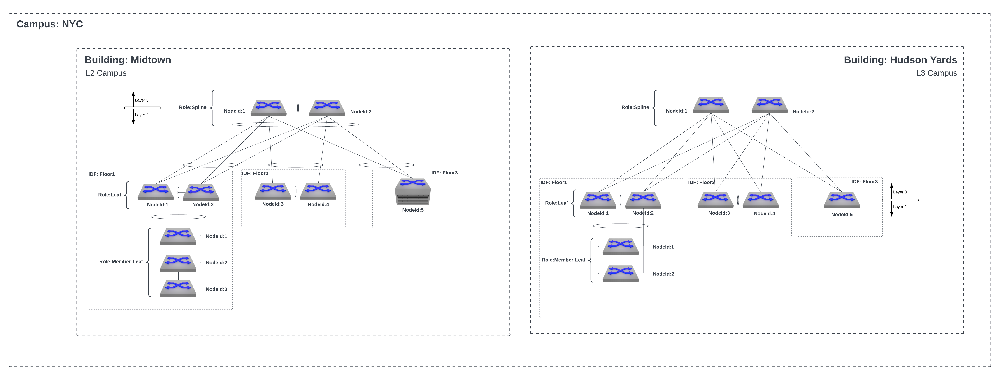

**These studios are currently only usable in CVaaS and are currently unavailable in on-prem instances**

This is an alpha version of a campus studio that gives users the ability to deploy L2 campuses with the plans to add support for L3 campus later. This studio is NOT officially supported by Arista.  The input schema and template for this studio are subject to change.  More documentation and details will be added later.  **It is not recommended to use this studio in production networks.**

The `avd-campus.yaml` studio currently requires the Tag Matcher Input type to be enabled from CloudVision's Settings page.

Below is a diagram of possible campus designs that can be created with the Campus Fabric studio along with examples of the tags needed to generate the proper device configuration.

