**These studios are currently only usable in CVaaS and are currently unavailable in on-prem instances**

This is a beta version of a campus studio that gives users the ability to deploy L2 or L3 campus fabrics.  The template for this studio is subject to change and additions to the data model may be made.  More documentation and details will be added later.  **It is not recommended to use this studio in production networks at this time.**

The `avd-campus.yaml` studio currently requires the Tag Matcher Input type to be enabled from CloudVision's Settings page.

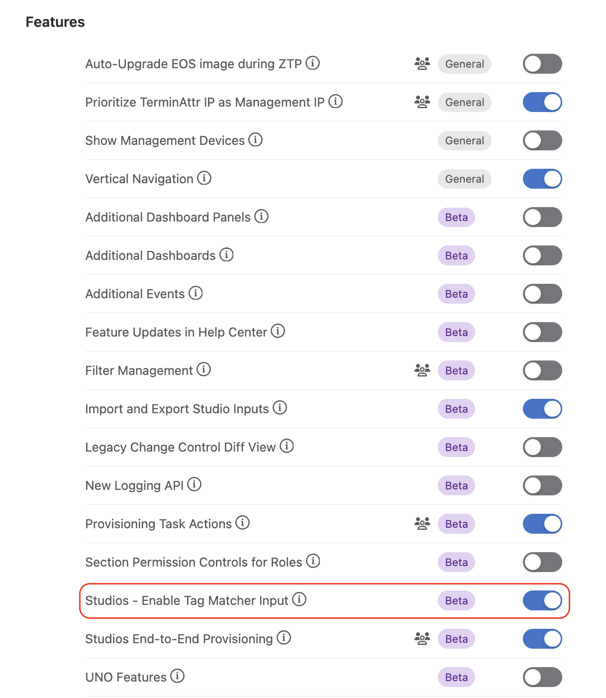

# Campus Fabric #
## Design ##
The way the campus fabric is abstracted is based on the model represented in the diagram below:

At the outermost level, there is the **Campus**. Within each Campus, there is at least 1 **Campus Pod**.  A Campus Pod is an area of the network consisting of a distribution layer of **Spine** switches that provides uplink connectivity for one or multiple downstream **Access Pods**.  These Access-Pods are basically IDFs or closets that provide endpoint users with access to the greater network so they can access data and voice services.

## Creating a Campus Fabric ##
To create a Campus Fabric in CloudVision Studios, select the AVD Campus Fabric studio.

### Creating a Campus ###
Once in the studio, create a Campus by typing in a name for the Campus then clicking the `+` button or hitting `Enter`.

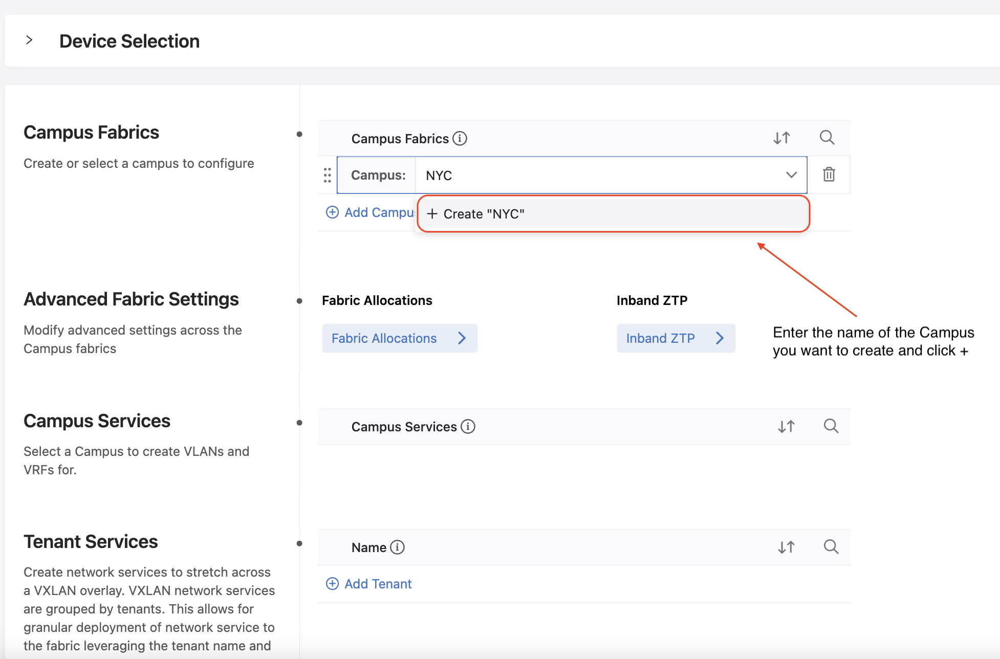

Once the Campus is created, click the arrow next to the campus name to continue configuration.

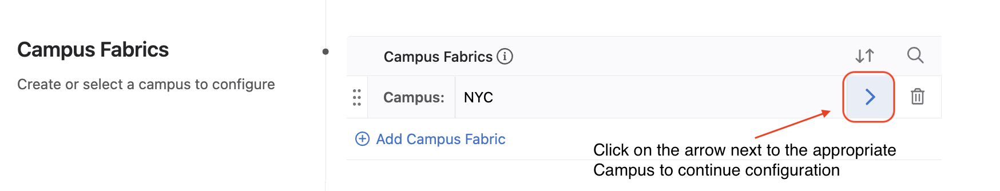

### Creating a Campus Pod ###

After selecting a Campus, you will be able to create Campus Pods within the selected campus.

Create a Campus Pod by typing in a name for the Campus Pod then clicking the `+` button or hitting `Enter`.

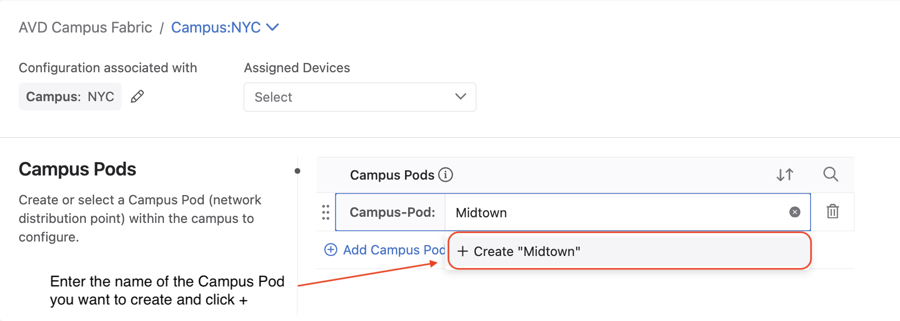

Once the Campus Pod is created, click the arrow next to the campus pod name to continue configuration.

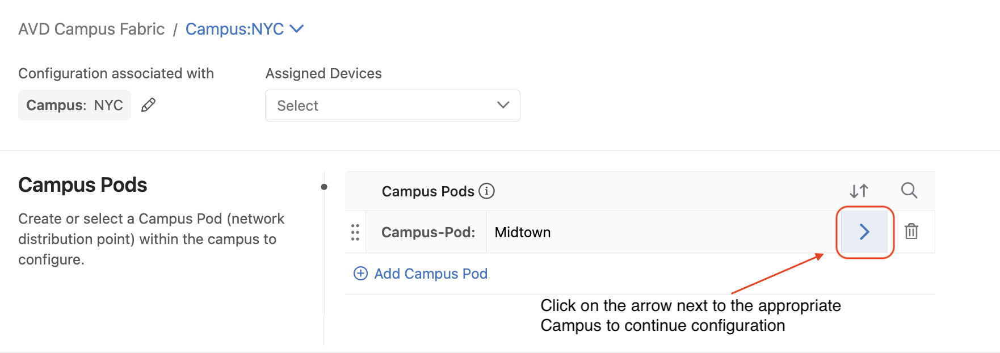

### Configuring a Campus Pod ###

After selecting a Campus Pod, you will be able to begin configuration for the selected campus pod's fabric.

It is on this page where users will define the campus pod fabric architecture, protocols, and protocol configuration details.

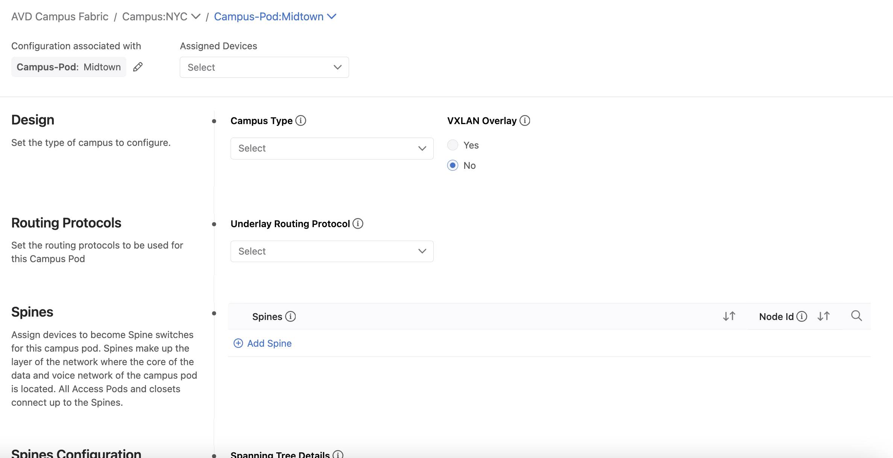

#### Set the Campus Pod Architecture ####

To begin, users must decide whether this Campus-Pod is an L2 or an L3 fabric and whether a VXLAN overlay needs to be configured.

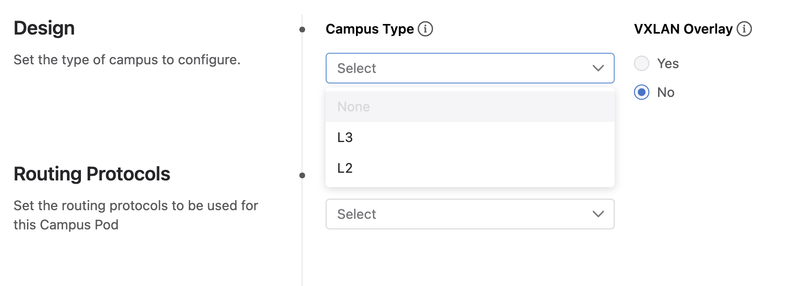

In an L2 campus fabric, the Spine switches are the L3 boundary for the fabric and connect downstream to Access Pods via L2 Port-Channels.  In an L3 campus fabric, the L3 boundary is pushed down to each Access Pod. 

> **_NOTE:_** Please refer to the diagram for a visual representation of the differences between an L2 and an L3 fabric.

Most designs do not call for a VXLAN overlay, but please consult your account team if you are curious about the benefits of adding a VXLAN overlay to the campus network to see if it's right for your organization.

#### Set the Campus Pod Routing Protocols ####

The next step is to select the routing protocols to be used in the fabric.

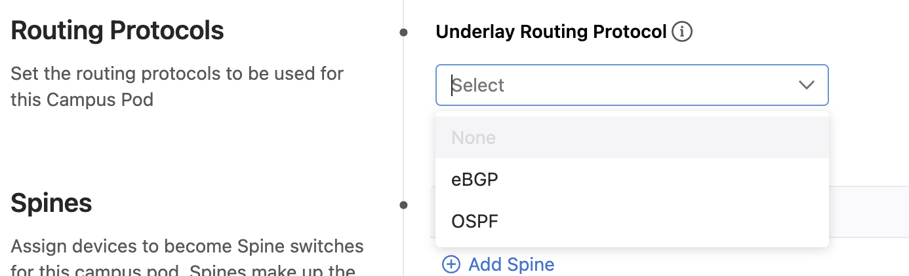

In an L3 campus, it is mandatory for users to select an `Underlay Routing Protocol`.  In an L2 campus, it is not mandatory for users to select an `Underlay Routing Protocol` but may still be useful for generating configuration for connectivity from the Spine switches to any core devices that are external to the Campus Pod fabric.

If VXLAN is turned on, users may also wish to set the `Underlay Routing Protocol`.

#### Set Configuration Parameters for Spine switches ####
Before actually adding Spine switches, it is necessary to set configuration parameters for the different protocols that will be configured on the Spines. For many of the configuration parameters, the default input values should suffice. However, every network is different, so users have the ability to modify default configuration values.

Different input parameters will be visible based on the campus type and routing protocols selected. Similarly, some input fields may require users to fill in input values depending on the design selected.

> **_NOTE:_** Depending on which version of CVP is running, users may encounter a cosmetic hide/show dependency issue where some fields that should be visible are hidden.  To workaround this, after selecting the `Campus Type`, `VXLAN`, and `Underlay Routing Protocol`/`Overlay Routing Protocol`, refresh the page.

#### Set Configuration Parameters for Access Pod switches ####
As was the case with Spine switches, before actually creating Access Pods and adding Leaf and Member Leaf switches to those Access Pods, it is necessary to set configuration parameters for the different protocols that will be configured across the Access Pods. Again, for many of the configuration parameters, the default input values should suffice. However, every network is different, so users have the ability to modify default configuration values.

Different input parameters will be visible based on the campus type and routing protocols selected. Similarly, some input fields may require users to fill in input values depending on the design selected.

> **_NOTE:_** Depending on which version of CVP is running, users may encounter a cosmetic hide/show dependency issue where some fields that should be visible are hidden.  To workaround this, after selecting the `Campus Type`, `VXLAN`, and `Underlay Routing Protocol`/`Overlay Routing Protocol`, simply refresh the page.

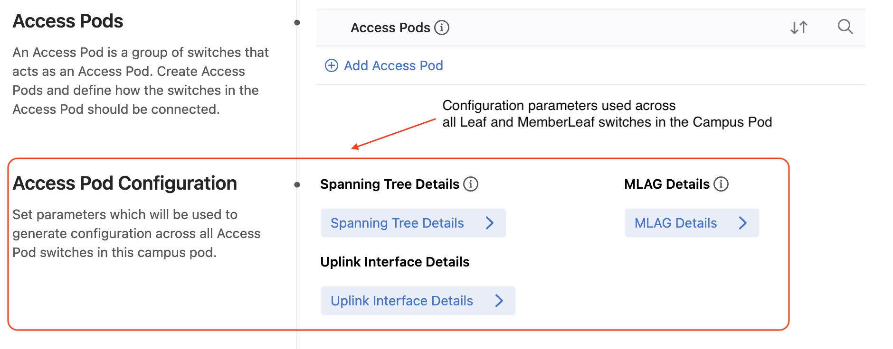

#### Set Fabric Configuration Parameters ####
The last step in creating a Campus Pod fabric is to set configuration for all devices across the fabric. Note that not every device will automatically inherit the fabric configuration settings defined in this section.  Configuration regarding different protocols get gets applied to devices based on the campus fabric design as well as each switch's role in the network (i.e. `Spine`, `Leaf`, or `Member Leaf`).

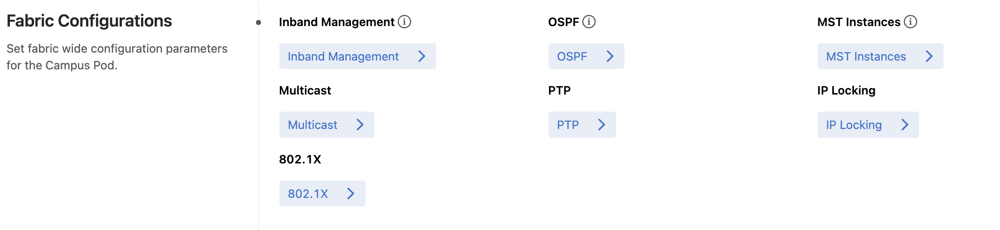

##### Set Inband Management Configuration #####
One crucial Fabric Configuration section to enter values for is the Inband Management section. 

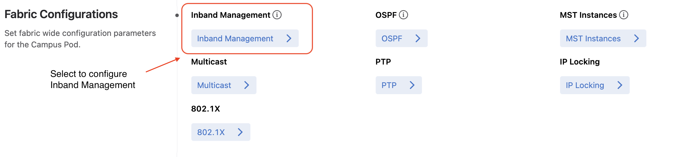

This section is important because it is used to set up the inband management configuration on the switches which enables each switch to connect to CVP through the data plane of the network (a common requirement in campus networks).  Currently, the studio limits inband management configuration to be set up in the default VRF.

Accordingly, users will need to specify a VLAN used for inband management as well as an inband management subnet for every L2 domain within the Campus Pod. Additionally, users can configure helper addresses on the inband management gateway switches in order to forward DHCP requests from switches undergoing the ZTP process to the appropriate DHCP server.

For an L2 campus, this means only 1 inband management subnet is required.

For an L3 campus, an inband management subnet per Access-Pod is required.

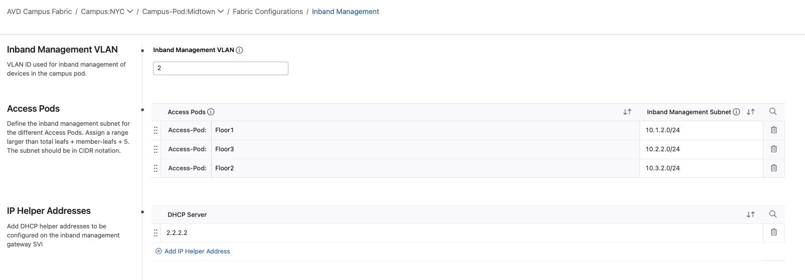

> **_NOTE:_** When setting up inband management subnets for an L3 campus, in order for the Access-Pod's `Inband Management Subnet` input field to be displayed, the Access-Pod must already be created and at least one switch should be added to the Access-Pod.  Instructions on how to add switches to Access Pods can be found below in the **Add Leafs and Member Leafs** section.

### Adding Switches to the Campus ###
#### Add Spines ####
To add spine switches, scroll back up to the **Spines** section and click the `+ Add Spine` button. Then select the device you wish to designate as a Spine and assign the proper Node ID.

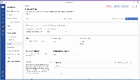

#### Add Leafs and Member Leafs ####
To add leaf and member leaf switches, we first need to create the Access Pods these switches will be members of.  Scroll back up to the **Access Pods** section and click the `+ Add Access Pod` button. Type in the name of the Access Pod you wish to create and hit the `+` button or hit `Enter`.

Now that the Access Pod has been created, it's time to add Leafs and Member Leafs to it.

To add leaf switches, find the **Leafs** section and click the `+ Add Leaf` button.  Then select the device you wish to designate as a Leaf and assign the proper Node ID in accordance with the campus type (L2 or L3).

To add member leaf switches, find the **Leafs** section and click the `+ Add Member-Leaf` button.  Then select the device you wish to designate as a Member Leaf and assign the proper Node ID in accordance with the campus type (L2 or L3).

Please refer back to the initial **Campus Fabric Topology** diagram for details on how to assign appropriate Node IDs to devices.

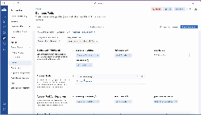

### Review ###
After all devices have been added to the Campus-Pod and assigned their respective Node IDs, we can build the configuration for each switch in our Campus-Pod by clicking on the Review Workspace button in the top right corner.

This will take us to the Workspace Review page where our changes should automatically kick off a new Workspace build which should in turn, generate EOS configuration for the devices in the Campus Pod.

Assuming the workspace builds successfully and the Proposed Configuration looks accurate, submit the workspace to confirm our changes for each switch's Designed Config.

Upon successful submission of the workspace, a change control should be created that let's us actually push the new Designed Configs to the appropriate switches to update their Running Configurations.

And that's it! At this point, the fabric should be up and ready to be configured with services.
