# ~~Connected Endpoints~~ Endpoint Connectivity - Beta
## This studio is in beta, it has, can, and most likely will continue to change

## Summary
The ~~Connected Endpoints~~ Endpoint Connectivity studio allows for configuration of L2 interfaces to end hosts and outbound connections alike.  Ethernet and Port-Channel interfaces are configurable on a given range of Ethernet interfaces, with features like VLAN assignment, tagging, PTP, STP, QOS and more.

## Configuration
Profiles can be created to apply a template of an interface configuration for multiple devices with minor changes on each. Anything configured at the profile will apply to the adapter the profile is applied to. Any changes made at the adapter level have a higher priority than those at the profile lever at build time.

Dot1x is the only global config generated. Dot1x configurations will generate the global config necesary for their operation, except a RADIUS server.

## Root Variables
### Endpoint Collections
The Endpoint Collections variable defines connectivity from the perspective of the endpoints that connect to the fabric.

It is a list of sets of endpoints which require a layer 2 connection to Arista switches.  Each entry in this list represents either a single endpoint or a group of endpoints. The studio will configure the switch or switches the endpoints in the set are connected to and apply the proper configuration to the switch interfaces that the endpoints are connected to based on the user inputs to the studio.

### Port Profiles
A list of interface templates which share common settings for switch interfaces connected to endpoints. Settings defined under endpoint collection entries take precedence over settings defined under profiles.

## Examples
### Single Homed Endpoint
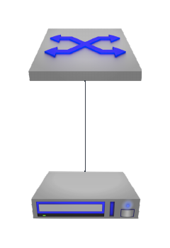

In this most basic example, we have a single endpoint, Host1, connected to a single switch, DC1-aLF1A. Based on the inputs, the studio assumes Host1 is connected to DC1-aLF1A on Ethernet5. 
<!------>

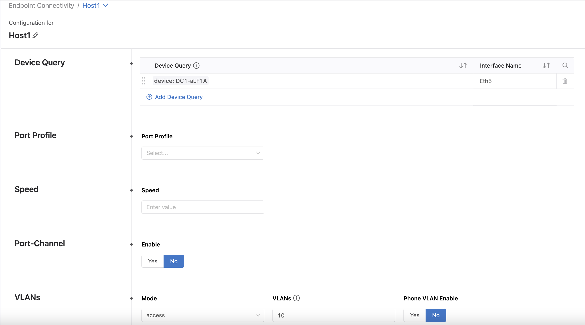

The inputs seen in the screenshot produce the configuration seen below on DC1-aLF1A.
```
interface Ethernet5
  description Host1
  switchport
  switchport access vlan 10
  switchport mode access
```

### Group of Single Homed Endpoints
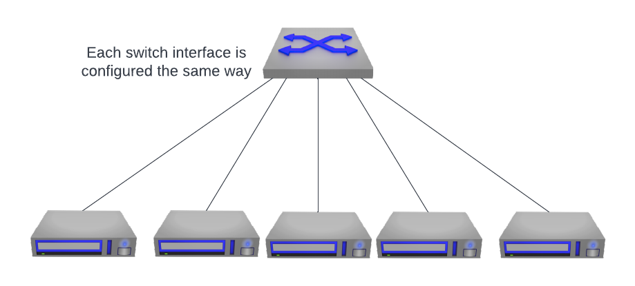

In this example, we will look at configuring connections to multiple endpoints, HostGroup1, with a single uplink to our switch, connected to a single switch, DC1-aLF1A. Based on the inputs, the studio assumes that multiple endpoints within the group HostGroup1 are connected to DC1-aLF1A on interfaces Ethernet1-5.
<!---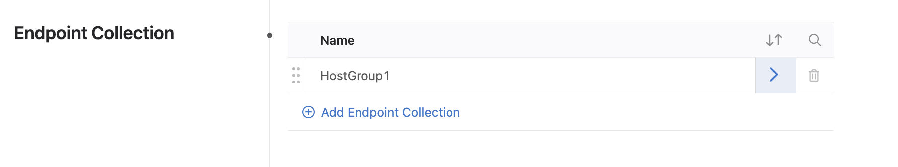--->

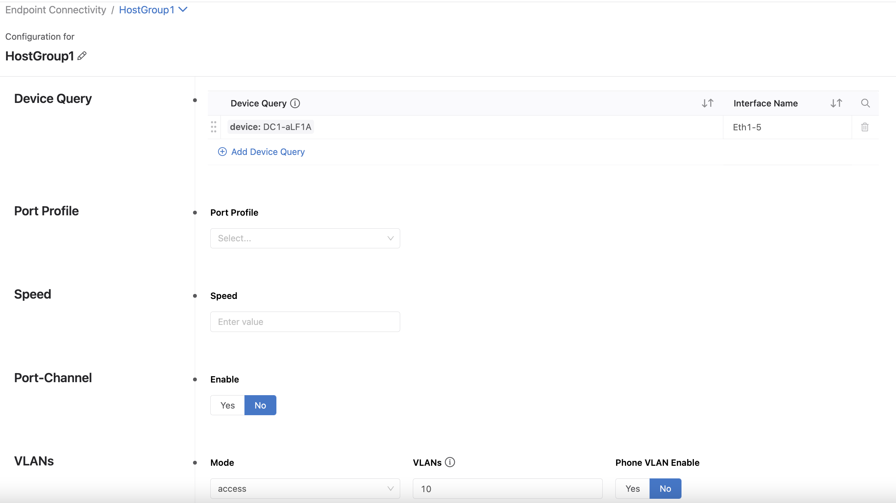

The inputs seen in the screenshot produce the configuration seen below on DC1-aLF1A.

```
interface Ethernet1-5
  description HostGroup1
  switchport
  switchport access vlan 10
  switchport mode access
```

Note that because these interfaces connected to the endpoints are not port-channel interfaces, it is posssible to configure interfaces for more than one switch at a time using the by adding or creating a device query that targets more than one switch.

### Single Homed Endpoint with LACP
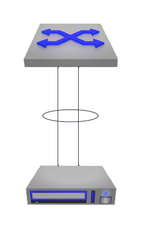

Here, we will look at creating a port-channel to an endpoint, Host1LACP, by configuring multiple interfaces on a switch, DC1-aLF1A. From the inputs, the studio creates a port-channel and adds our the user supplied interfaces to it.

<!------>

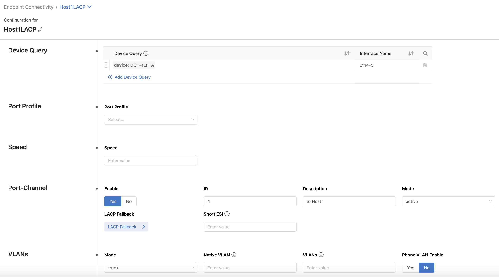

The inputs seen in the screenshot produce the configuration seen below on DC1-aLF1A.

```
interface Port-Channel4
  no shutdown
  description Host1LACP_to Host1
  switchport
  switchport mode trunk
!
interface Ethernet4-5
  description Host1LACP
  channel-group 4 mode active
```

Note that you cannot configure multiple endpoints that are single homed with LACP within a single Endpoint Collection entry. If this were to be attempted, the studio may assume that the endpoint is dual homed to other switches which match the Device Query resolver.  To avoid this confusion, use a unique endpoint collection entries for endpoints that are single homed with LACP.

### Dual Homed Endpoint
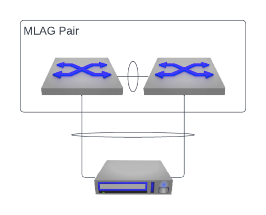

In this example, we will create an Active/Active port-channel between our endpoint, Host1, to our switches in an MLAG pair, DC1-aLF1A and DC1-aLF1B.

<!---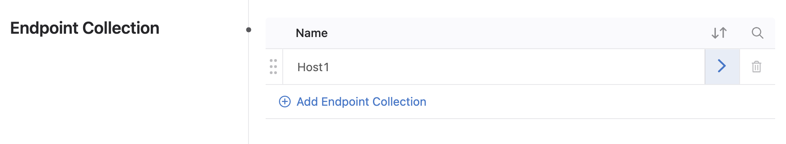--->

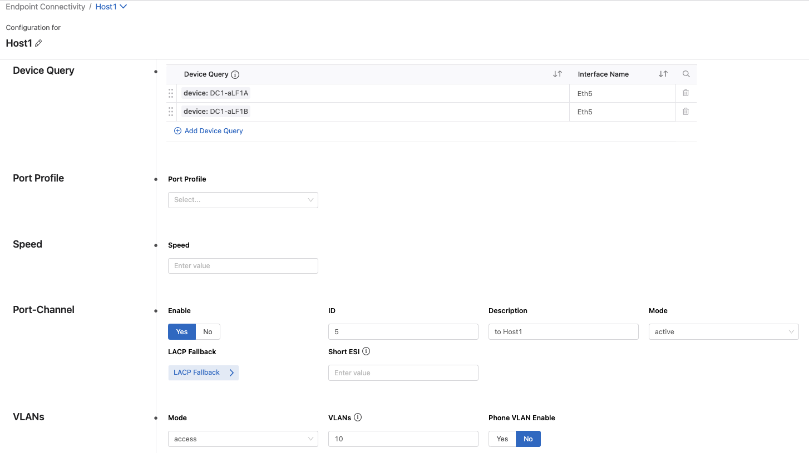

The inputs seen in the screenshot produce the configuration seen below on DC1-aLF1A and DC1-aLF1B.

```
interface Port-Channel5
  no shutdown
  description to Host1
  switchport
  switchport access vlan 10
  mlag 5
!
interface Ethernet5
  description Host1
  channel-group 5 mode active
!
```

### Multi Homed Endpoint
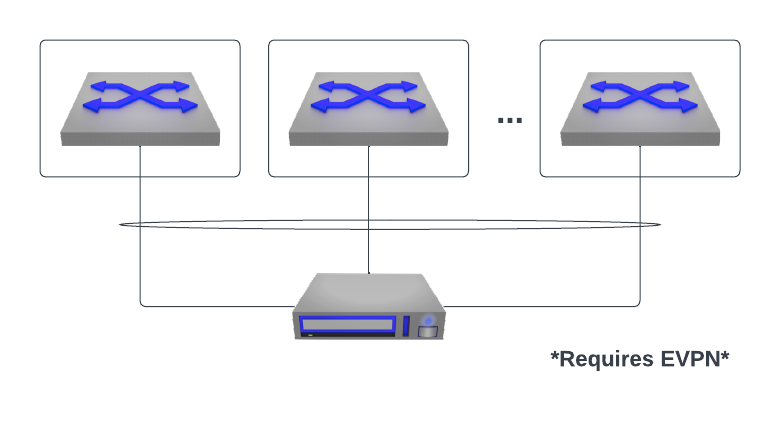

In this example, we will create an Active/Active port-channel between our endpoint, Host1, to our switches which are NOT in an MLAG pair, DC1-aLF1A and DC1-aLF2A. This configuration takes advantage of EVPN ESI multi-homing and requires the upstream switches to be running EVPN.

<!------>

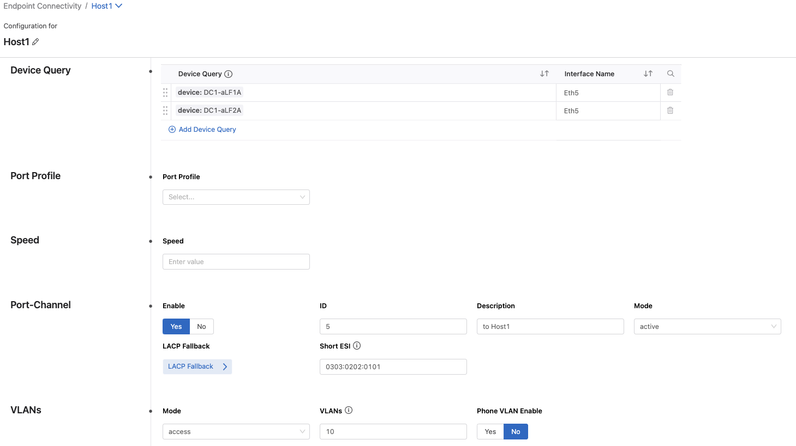

The inputs seen in the screenshot produce the configuration seen below on DC1-aLF1A and DC1-aLF2A.

```
interface Port-Channel5
  no shutdown
  description to Host1
  switchport
  switchport access vlan 10
  evpn ethernet-segment
      identifier 0000:0000:0303:0202:0101
      route-target import 03:03:02:02:01:01
  lacp system-id 0303.0202.0101
!
interface Ethernet5
  description Host1
  channel-group 5 mode active
!
```

Note that for every host, the ESI needs to be unique. Therefore, users can only configure one host using an ESI per Endpoint Collection entry using this studio.