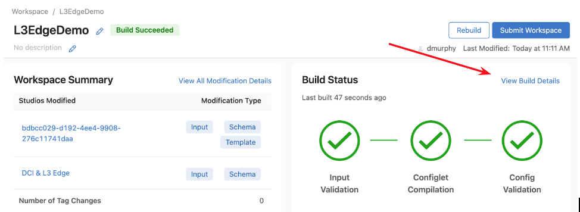

# **DCI & L3 Edge Studio**

## **Summary**

The L3 Edge studio allows users to create point-to-point connections between devices by configuring routed interfaces and any necessary neighbor configuration on assigned devices. Currently, the only routing protocol supported by this studio is BGP.

## **Inputs**

The schema is made up of two root variables: _Point to Point Links _and _Point to Point Links Profiles._

### Point to Point Links

Point to Point Links is a collection of L3 links that exist throughout the network (Note that not all L3 links that exist in the network are configured by this studio. Therefore, not all L3 links will be present in this collection). To configure links between devices, users add to this collection by adding a name for the link. Once a name for the link has been input, users can click on the arrow to the right of the name to add details for the link in order to configure connectivity between two devices.

### Point to Point Profiles

Point to Point Links Profiles is a collection of templates for link characteristics.  These profiles can be selected as an attribute of a link when configuring Point to Point Links. This enables users to quickly assign attributes to a link.

## Example: Configuring the p2p link Between DC1-aLF1A and core1

1. Make sure the studio is assigned to the devices you wish to configure.

2. Add a point to point link and give it a unique name.

3. Enter inputs in order to configure connectivity between two devices. 
    1. Required inputs:
        1. Nodes
            * Add the hostnames of the nodes the link will be configured between.
            * In order for the link to be configured on a device, the hostname must match the hostname of the device in CVP. 
            * Note that both nodes do not have to be present in CVP.
        2. Interfaces
            * Add the name of the interface to configure on the node.
            * The index of the interface name in the Interfaces collection must match the index of the node it is to be configured on in the Nodes collection.
        3. IP Addresses
            * Add the IP address (including subnet mask) to configure on the interface of the node.
            * The index of the IP address in the IP Addresses collection must match the index of the interface it is to be configured on in the Interfaces collection.

        

The order of each input corresponds with the order of the other inputs; Per the example, we are configuring DC1-aLF1A’s Ethernet8 interface with IP address 10.245.0.0/31 and stating that its ASN is 65001. DC1-aLF1A is connected to core 1’s Ethernet4 interface which has an IP address 10.245.0.1/31, and core1’s BGP ASN is 62100.

All remaining input fields are optional: Speed, MTU, PTP Enable, QOS Profile, Macsec Profile, and Profile.

4. After completing inputs, select _Review Workspace._

5. To view generated configuration, select _View Build Details._

